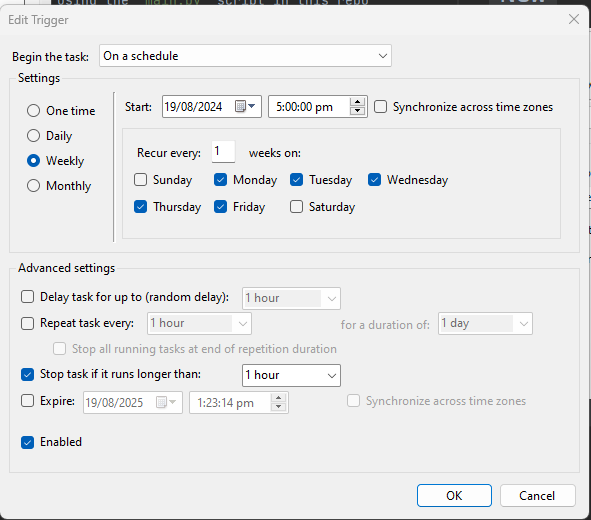
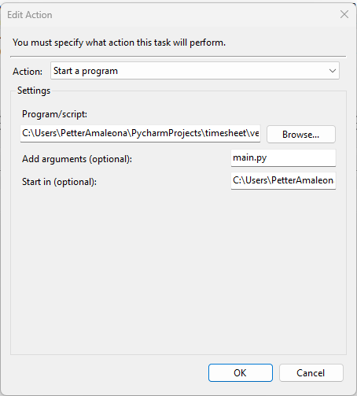

# Instructions on how to use
1. Replace the values in `.env` file to your actual credentials.
2. Install the dependencies by running `pip install -r requirements.txt`
3. Select `Task Scheduler` in Windows and create a task
   1. In `Triggers` tab, set it to `Weekly` and select only weekdays
   2. Update the time based on your preference.
4. Go to `Actions` tab,
   1. Click `New` to create an actions using the `main.py` script in this repo
   2. In the `Program/Script`, add the python interpreter or executable path. This will handle our script based on python.
   3. In the `Add arguments (optional)`, add the `main.py` as the value
   4. Lastly, in the `Start in (optional)`, add the path where the `main.py` is located.

# Screenshot from `Triggers` tab config

# Screenshot from `Actions` tab config
